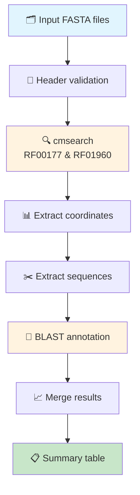

# 🧬 SSUextract: Small Subunit rRNA Extraction Pipeline

[](https://github.com/NeLLi-team/ssuextract/releases)
[](https://opensource.org/licenses/MIT)
[](https://snakemake.github.io)
[](https://pixi.sh)

A high-performance bioinformatics pipeline for extracting and annotating Small Subunit (SSU) rRNA sequences from genomic assemblies using covariance models.

## 🎯 Overview

SSUextract identifies SSU rRNA sequences in your genomic data by:
- 🔍 Searching with Infernal's cmsearch using curated covariance models
- 🧮 Extracting high-quality SSU sequences based on configurable parameters
- 🏷️ Annotating sequences with taxonomic information via BLAST
- 📊 Generating comprehensive summary reports

## 🚀 Quick Start

### Prerequisites
- [pixi](https://pixi.sh) package manager

### Installation

```bash
# Clone the repository
git clone https://github.com/yourusername/ssuextract.git
cd ssuextract

# Install dependencies and download reference database
pixi run setup
```

### Basic Usage

```bash
# Run on example data
pixi run snakemake --cores 4 --configfile config/default.yaml

# Results will be in: results/example/
```

## 🔧 Pipeline Architecture



## 📁 Project Structure

```
ssuextract/
├── 📄 Snakefile             # Pipeline workflow definition
├── 📦 pixi.toml             # Dependencies and tasks
├── 📂 config/               # Configuration files
│   └── default.yaml         # Pipeline configuration
├── 📂 scripts/              # Pipeline scripts
│   ├── cmprocessing.py      # BLAST result processing
│   ├── get_cmsequences.py   # Sequence extraction
│   ├── get_cmstats.py       # Alignment statistics
│   ├── get_table.py         # Summary table generation
│   └── rename_fnaheaders.py # Header validation
├── 📂 resources/            # Static resources
│   ├── models/              # Covariance models
│   │   ├── RF00177.cm      # Bacterial/Archaeal SSU
│   │   └── RF01960.cm      # Eukaryotic SSU
│   └── database/            # Reference database
├── 📂 data/                 # Input data
│   └── example/             # Example test data
└── 📊 results/              # Output directory
    └── {dataset}/           # Dataset-specific results
        ├── fna/             # Processed sequences
        ├── out/             # cmsearch outputs
        ├── stats/           # Alignment statistics
        ├── extracted/       # Extracted SSU sequences
        ├── m8/              # BLAST results
        └── *.tsv            # Summary tables
```

## ⚙️ Configuration

Edit `config/default.yaml` to customize the pipeline:

```yaml
# Directory containing covariance models (.cm files)
modeldir: "resources/models"

# Directory containing query sequences (.fna files)  
querydir: "data/example"

# Number of threads per job
threads_per_job: 2

# Minimum sequence length for extraction (bp)
min_extract_length: 30
```

### Custom Data

```bash
# Place your .fna files in data/your_dataset/
mkdir data/your_dataset
cp /path/to/*.fna data/your_dataset/

# Create custom config
cat > config/my_config.yaml << EOF
modeldir: "resources/models"
querydir: "data/your_dataset"
threads_per_job: 4
min_extract_length: 30
EOF

# Run pipeline
pixi run snakemake --cores 8 --configfile config/my_config.yaml
```

Results will be in `results/your_dataset/`

## 📊 Output Files

### Main Output: `results/{dataset}/cmsearch_summary.tsv`

A comprehensive table containing:
- **name**: Sequence identifier
- **sample**: Source sample name (basename of input file)
- **model**: CM model used (RF00177/RF01960)
- **length**: Sequence length
- **coordinates**: Genomic coordinates
- **strand**: DNA strand (+/-)
- **sequence_type**: Hit type (simple/complex)
- **contig_name**: Source contig
- **blast_sseqid**: Best BLAST hit with taxonomy
- **blast_pident**: Percent identity
- **blast_length**: Alignment length
- **blast_bitscore**: BLAST bit score
- **is_assembled**: Assembly status

### Category Summary: `results/{dataset}/cmsearch_summary.tab`

Counts of SSU types per sample:
- BacteriaSSU
- ArchaeaSSU
- EukaryotaSSU
- MitochondriaSSU
- PlastidSSU
- And more specialized categories

## 🛠️ Available Commands

```bash
# Setup and installation
pixi run setup              # Install deps + download database

# Pipeline execution
pixi run run                # Run full pipeline (default config)
pixi run dryrun            # Preview what will be executed

# Custom execution
pixi run snakemake --cores 8 --configfile config/my_config.yaml

# Database management
pixi run download-db        # Download reference database

# Cleanup
pixi run clean             # Clean pipeline outputs
pixi run clean-results     # Remove all results directories

# Development
pixi run -e dev run-verbose # Verbose output
pixi run -e dev report      # Generate HTML report
pixi run -e dev dag         # Generate pipeline visualization
```

## 🔬 Pipeline Details

### Step 1: Input Validation
- Validates FASTA headers with `scripts/rename_fnaheaders.py`
- Ensures compatible formatting

### Step 2: Covariance Model Search
- Uses Infernal's cmsearch with `--anytrunc` flag
- Searches for both bacterial/archaeal (RF00177) and eukaryotic (RF01960) SSU

### Step 3: Hit Processing
- Extracts alignment coordinates with `scripts/get_cmstats.py`
- Handles truncated alignments
- Filters by minimum length (configurable: default 30bp)

### Step 4: Sequence Extraction
- Extracts sequences based on coordinates with `scripts/get_cmsequences.py`
- Handles reverse complement for minus strand hits

### Step 5: Taxonomic Annotation
- BLAST search against SILVA/PR2 database
- Processes results with `scripts/cmprocessing.py`

### Step 6: Report Generation
- Merges all results with `scripts/get_table.py`
- Creates summary statistics
- Generates final TSV report

## 🐛 Troubleshooting

### Empty BLAST results
- Check minimum length setting in config/default.yaml
- Verify extracted sequences meet length threshold
- Ensure database was downloaded correctly

### Pipeline locked error
```bash
pixi run snakemake --unlock --configfile config/default.yaml
```

### Memory issues
- Reduce `threads_per_job` in config/default.yaml
- Process fewer files at once

### File path errors
- Ensure input files have `.fna`, `.fa`, or `.fasta` extensions
- Check that `querydir` path exists and contains sequence files

## 📝 Citation

If you use SSUextract in your research, please cite:

```
SSUextract: A Snakemake pipeline for SSU rRNA extraction
[Your publication details here]
```

## 🤝 Contributing

Contributions are welcome! Please:
1. Fork the repository
2. Create a feature branch
3. Commit your changes
4. Push to the branch
5. Open a Pull Request

## 📄 License

This project is licensed under the MIT License - see the [LICENSE](LICENSE) file for details.

## 🙏 Acknowledgments

- [Infernal](http://eddylab.org/infernal/) for covariance model searches
- [SILVA](https://www.arb-silva.de/) and [PR2](https://pr2-database.org/) databases
- [Snakemake](https://snakemake.github.io) workflow engine
- [pixi](https://pixi.sh) package manager

---

<p align="center">Made with ❤️ for the bioinformatics community</p>