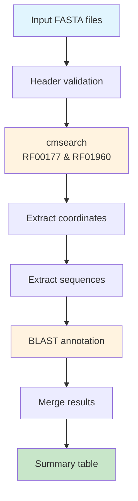

# SSUextract: Small Subunit rRNA Extraction Pipeline

[](https://github.com/NeLLi-team/ssuextract/releases/latest)
[](https://opensource.org/licenses/MIT)
[](https://nextflow.io)
[](https://pixi.sh)

A high-performance bioinformatics pipeline for extracting and annotating Small Subunit (SSU) rRNA sequences from genomic assemblies using covariance models.

> **Nextflow Pipeline**: Complete conversion from Snakemake to Nextflow for improved scalability and cloud compatibility. This is now the main branch (v1.0.0).

## Overview

SSUextract identifies SSU rRNA sequences in genomic data through the following workflow:

1. **Search**: Identifies SSU rRNA regions using Infernal's cmsearch with curated covariance models
2. **Extract**: Extracts high-quality SSU sequences based on configurable length thresholds
3. **Annotate**: Assigns taxonomic classification via BLAST against reference databases
4. **Report**: Generates comprehensive summary tables with sequence metadata and taxonomy

## Quick Start

### Prerequisites

Install the [pixi](https://pixi.sh) package manager:

```bash
curl -fsSL https://pixi.sh/install.sh | sh
```

### Installation

```bash
# Clone the repository
git clone https://github.com/NeLLi-team/ssuextract.git
cd ssuextract

# Install dependencies and download the default reference database (SILVA/PR2)
pixi run setup
```

### Basic Usage

```bash
# Run on example data
pixi run run

# Results will be in: results/example/
```

## Reference Databases

SSUextract supports two reference databases for taxonomic annotation:

### SILVA/PR2 Database (Default)

A combined database containing:
- **SILVA 138.1**: Curated bacterial and archaeal 16S/18S rRNA sequences
- **PR2 4.12**: Protist Ribosomal Reference database for eukaryotic sequences

This database is automatically downloaded during setup.

**Taxonomy format**: Sequences are annotated with semicolon-delimited taxonomy strings:
```
>REF_SILVA_AB001445.1.1538;Bacteria;Proteobacteria;Gammaproteobacteria;Pseudomonadales;...
```

### EukCensus Database

The EukCensus 2025 database contains SSU sequences derived from IMG/JGI metagenome assemblies, providing broader coverage of environmental microbial diversity.

**Contents**:
- `eukcensus_2025_16S.fna`: Bacterial/Archaeal 16S sequences (~1.3M sequences)
- `eukcensus_2025_18S.fna`: Eukaryotic 18S sequences (~400K sequences)
- Cluster information and metadata files

**Taxonomy formats**:
- 16S sequences: SILVA-style semicolon-delimited taxonomy
- 18S sequences: Underscore-delimited taxonomy paths
  ```
  >REF_SPR_AB041247.1.1790_Eukaryota_Amorphea_Obazoa_Opisthokonta_Nucletmycea_Fungi_...
  ```

#### Setting Up EukCensus

1. Obtain the EukCensus files and place them in the `eukcensus/` directory:
   ```
   eukcensus/
   ├── eukcensus_2025_16S.fna
   ├── eukcensus_2025_18S.fna
   ├── eukcensus_2025_16S_clusters.tsv
   ├── eukcensus_2025_18S_clusters.tsv
   └── eukcensus_2025_img_metadata.tsv
   ```

2. Run the setup command:
   ```bash
   pixi run setup-eukcensus
   ```

3. Run the pipeline with the EukCensus database:
   ```bash
   nextflow run main.nf --querydir data/my_samples --database eukcensus
   ```

#### EukCensus Cluster Files

The cluster files provide pre-computed sequence clustering information:

| Column | Description |
|--------|-------------|
| cluster_id | Unique cluster identifier |
| centroid | Representative sequence ID |
| size | Number of sequences in cluster |
| tax_type | Prokaryote or Eukaryote |
| superg | Supergroup classification |
| phylum | Phylum-level taxonomy |
| class | Class-level taxonomy |
| order | Order-level taxonomy |
| family | Family-level taxonomy |
| genus | Genus-level taxonomy |

#### IMG Metadata

The `eukcensus_2025_img_metadata.tsv` file contains sample metadata from IMG/JGI including:
- Sequencing information (platform, coverage)
- Geographic coordinates
- Environmental parameters (pH, salinity)
- Ecosystem classification
- Assembly statistics

## Pipeline Architecture



## Project Structure

```
ssuextract/
├── main.nf               # Nextflow pipeline definition
├── nextflow.config       # Nextflow configuration
├── pixi.toml             # Dependencies and tasks
├── config/               # Configuration files
│   └── default.yaml      # Pipeline configuration
├── scripts/              # Pipeline scripts
│   ├── cmprocessing.py   # BLAST result processing
│   ├── get_cmsequences.py# Sequence extraction
│   ├── get_cmstats.py    # Alignment statistics
│   ├── get_table.py      # Summary table generation
│   └── rename_fnaheaders.py # Header validation
├── resources/            # Static resources
│   ├── models/           # Covariance models
│   │   ├── RF00177.cm    # Bacterial/Archaeal SSU
│   │   └── RF01960.cm    # Eukaryotic SSU
│   └── database/         # Reference databases
│       ├── silva-138-1_pr2-4-12.*  # Default SILVA/PR2
│       └── eukcensus/    # Optional EukCensus database
├── data/                 # Input data
│   └── example/          # Example test data
└── results/              # Output directory
    └── {dataset}/        # Dataset-specific results
```

## Configuration

### Command Line Parameters

```bash
# Run with custom parameters
nextflow run main.nf \
    --querydir data/my_dataset \
    --threads_per_job 4 \
    --min_extract_length 50 \
    --database silva-pr2
```

### Available Parameters

| Parameter | Default | Description |
|-----------|---------|-------------|
| `--querydir` | `data/example` | Path to input FASTA files |
| `--modeldir` | `resources/models` | Path to covariance models |
| `--outdir` | `results/{dataset}` | Output directory |
| `--database` | `silva-pr2` | Database: `silva-pr2` or `eukcensus` |
| `--database_path` | `resources/database` | Path to database files |
| `--min_extract_length` | `30` | Minimum sequence length (bp) |
| `--threads_per_job` | `2` | CPU threads per process |

### Custom Data

```bash
# Place your .fna files in data/your_dataset/
mkdir data/your_dataset
cp /path/to/*.fna data/your_dataset/

# Run pipeline on custom data
nextflow run main.nf --querydir data/your_dataset --threads_per_job 4
```

## Output Files

### Main Output: `cmsearch_summary.tsv`

A comprehensive table containing all extracted SSU sequences:

| Column | Description |
|--------|-------------|
| name | Sequence identifier |
| sample | Source sample name |
| model | CM model used (RF00177/RF01960) |
| length | Sequence length (bp) |
| coordinates | Genomic coordinates |
| strand | DNA strand (+/-) |
| sequence_type | Hit type (simple/complex) |
| contig_name | Source contig |
| blast_sseqid | Best BLAST hit with taxonomy |
| blast_pident | Percent identity (0-100) |
| blast_length | Alignment length (bp) |
| blast_bitscore | BLAST bit score |
| is_assembled | Assembly status |

### Category Summary: `cmsearch_summary.tab`

Counts of SSU types per sample:

| Category | Description |
|----------|-------------|
| BacteriaSSU | Bacterial 16S rRNA |
| ArchaeaSSU | Archaeal 16S rRNA |
| EukaryotaSSU | Eukaryotic 18S rRNA |
| MitochondriaSSU | Mitochondrial rRNA |
| PlastidSSU | Plastid/Chloroplast rRNA |
| CyanobacteriaSSU | Cyanobacterial 16S rRNA |
| RickettsialesSSU | Rickettsiales 16S rRNA |
| PatescibacteriaSSU | Patescibacteria 16S rRNA |

## Available Commands

```bash
# Setup and installation
pixi run setup              # Install deps + download SILVA/PR2 database
pixi run setup-eukcensus    # Setup EukCensus database
pixi run setup-all          # Setup both databases

# Pipeline execution
pixi run run                # Run full pipeline (default config)
pixi run dryrun             # Preview what will be executed

# Custom execution
nextflow run main.nf --querydir data/my_dataset
nextflow run main.nf --querydir data/my_dataset --database eukcensus

# Database management
pixi run download-db        # Download SILVA/PR2 database
pixi run download-eukcensus # Setup EukCensus database

# Cleanup
pixi run clean              # Clean pipeline work directories
pixi run clean-results      # Remove all results directories

# Development
pixi run -e dev run-verbose # Verbose output with traces
pixi run -e dev report      # Generate HTML report
pixi run -e dev dag         # Generate pipeline DAG visualization
```

## Pipeline Details

### Step 1: Input Validation
- Validates FASTA headers using `scripts/rename_fnaheaders.py`
- Ensures compatible formatting for downstream processing

### Step 2: Covariance Model Search
- Uses Infernal's cmsearch with `--anytrunc` flag for truncated sequences
- Searches for bacterial/archaeal SSU (RF00177) and eukaryotic SSU (RF01960)

### Step 3: Hit Processing
- Extracts alignment coordinates using `scripts/get_cmstats.py`
- Handles truncated alignments at sequence boundaries
- Filters by minimum length (default: 30 bp)

### Step 4: Sequence Extraction
- Extracts sequences based on coordinates using `scripts/get_cmsequences.py`
- Handles reverse complement for minus strand hits

### Step 5: Taxonomic Annotation
- BLAST search against selected reference database
- Processes results with `scripts/cmprocessing.py`
- Maps hits to taxonomic categories

### Step 6: Report Generation
- Merges all results with `scripts/get_table.py`
- Creates summary statistics per sample
- Generates final TSV reports

## Troubleshooting

### Empty BLAST results
- Verify the database was downloaded correctly
- Check minimum length setting (sequences shorter than threshold are excluded)
- Ensure extracted sequences meet length requirements

### Pipeline locked error
```bash
pixi run clean
# or
nextflow clean -f
```

### Memory issues
- Reduce `threads_per_job` parameter
- Use profile configurations: `nextflow run main.nf -profile local`
- Adjust `max_memory` in `nextflow.config`

### File path errors
- Ensure input files have `.fna`, `.fa`, or `.fasta` extensions
- Verify `querydir` path exists and contains sequence files
- Check file permissions

### Database not found
```bash
# For SILVA/PR2
pixi run download-db

# For EukCensus
pixi run setup-eukcensus
```

## Changelog

### v1.0.0 (Latest) - 2024-06-06
- **Major Release**: Complete migration from Snakemake to Nextflow
- Enhanced workflow structure with improved modularity
- Updated covariance models (RF00177.cm and RF01960.cm)
- Comprehensive documentation updates
- Legacy Snakemake version preserved in `ssuextract-snk` branch

### v1.0.1 - Database Selection
- Added support for EukCensus 2025 database
- New `--database` parameter for database selection
- Setup commands for multiple database configurations

### Previous Versions
- **v0.9.0** - Last Snakemake version (in `ssuextract-snk` branch)
- [View all releases](https://github.com/NeLLi-team/ssuextract/releases)

## Citation

If you use SSUextract in your research, please cite:

```
SSUextract: A Nextflow pipeline for SSU rRNA extraction
[Publication details pending]
```

## Contributing

Contributions are welcome. Please:
1. Fork the repository
2. Create a feature branch
3. Commit your changes
4. Push to the branch
5. Open a Pull Request

## License

This project is licensed under the MIT License - see the [LICENSE](LICENSE) file for details.

## Acknowledgments

- [Infernal](http://eddylab.org/infernal/) for covariance model searches
- [SILVA](https://www.arb-silva.de/) and [PR2](https://pr2-database.org/) databases
- [IMG/JGI](https://img.jgi.doe.gov/) for metagenome data (EukCensus)
- [Nextflow](https://nextflow.io) workflow engine
- [pixi](https://pixi.sh) package manager

---

<p align="center">Developed by the NeLLi Team</p>
