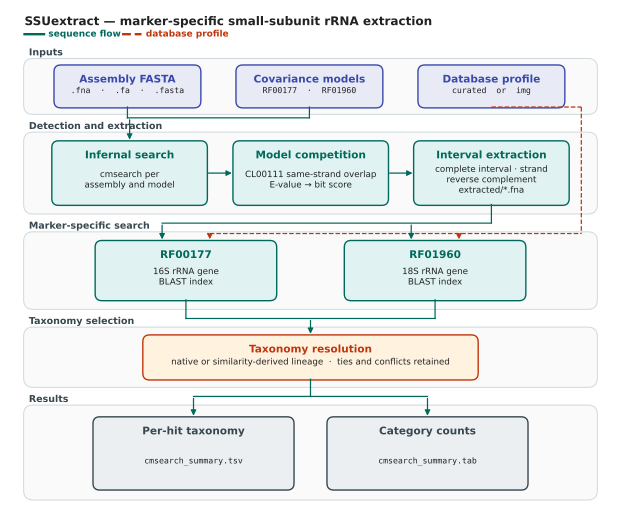

# SSUextract

SSUextract is a Nextflow pipeline that detects 16S rRNA genes and 18S rRNA
genes in assembled contigs, extracts complete hit intervals, and assigns
taxonomy with marker-specific reference databases.

[](docs/assets/figures/pipeline-architecture.svg)

## Quick start

```bash
git clone https://github.com/NeLLi-team/ssuextract.git
cd ssuextract
pixi install --frozen
pixi run setup
pixi run example
```

`pixi run setup` lists the `curated` and `img` profiles with their database
versions and download sizes. Select a profile by number or name. That selection
becomes the default for later pipeline runs. Interactive runs check Zenodo and
offer to install a newer release before Nextflow starts. During a download, one
terminal line shows written bytes, transfer rate, and estimated time remaining.
Rerun the same setup command after an interrupted transfer; it continues from
the retained partial archive and verifies the completed archive before
extraction.

Documentation: [tutorial](https://nelli-team.github.io/ssuextract/tutorials/first-run/),
[parameters](https://nelli-team.github.io/ssuextract/reference/cli/),
[output files](https://nelli-team.github.io/ssuextract/reference/outputs/), and
[database profiles](https://nelli-team.github.io/ssuextract/reference/database-profiles/).

Run `pixi run ssuextract --help` for the command-line summary. SSUextract is
distributed under the [MIT license](LICENSE).
