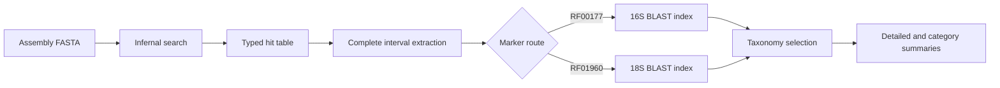

# Pipeline design

SSUextract separates detection, extraction, annotation, and reporting so each
stage owns one representation and one set of output files.

Infernal supplies 1-based inclusive coordinates. The extraction stage retains
both endpoints and reverse-complements negative-strand intervals. The typed hit
table carries sample, model, contig, coordinates, strand, and sequence identity
into later stages without reconstructing metadata from filenames.

Marker routing keeps 16S queries out of the 18S database and 18S queries out of
the 16S database. Final reporting scans each BLAST result once and sorts emitted
rows for deterministic tabular output.

