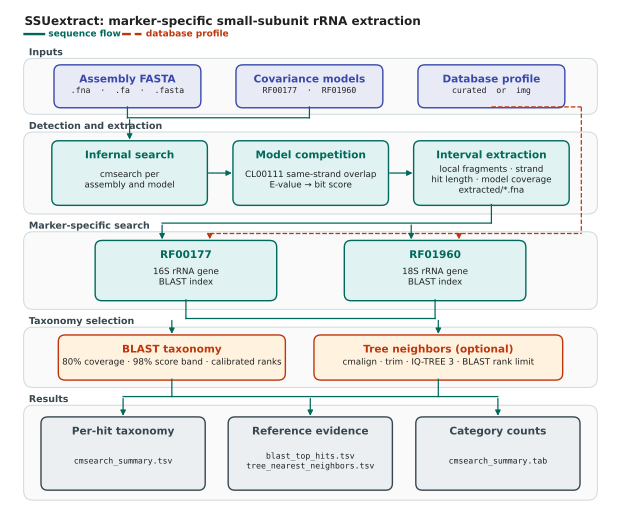

# Pipeline design

SSUextract detects candidate regions, extracts their sequences, selects a
marker-specific database, and reports taxonomy.

{ .docs-figure }

*Click the figure to open the full-size SVG.*

## Detection and extraction

Infernal supplies 1-based inclusive coordinates. The extraction stage retains
both endpoints and reverse-complements negative-strand intervals. The typed hit
table carries sample, model, contig, coordinates, strand, and sequence identity
into annotation.

Partial hits can form one extraction only when they have the same strand, occur
in model order, and do not overlap. The gap between sequence intervals must not
exceed the missing model span. A hit that covers both model endpoints blocks a
join across its coordinates. Other fragments remain separate. The minimum-length
filter uses the union of CM-hit sequence spans, so a gap between fragments cannot make the
extraction pass that filter. Each output retains the component coordinates and
model coverage. An intron within one CM hit contributes to its sequence span;
the hit table does not identify every aligned nucleotide.

RF00177 and RF01960 belong to Rfam clan CL00111 and can recognize the same SSU
locus. For overlapping same-strand hits, SSUextract retains the lower Infernal
E-value. Equal E-values are resolved by the higher bit score. An exact tie stops
the run instead of selecting a model without supporting evidence.

Any overlapping pair of different models without a defined competition rule
stops the run.

## Marker-specific annotation

RF00177 sequences use the 16S rRNA gene BLAST index. RF01960 sequences use the
18S rRNA gene index. The selected `curated` or `img` profile supplies both
indexes and their taxonomy tables.

Searches use `blastn -task blastn -evalue 1e-5 -max_hsps 1`. Query assignment
requires at least 80% query coverage and uses subjects with bit scores at least
98% of the best eligible score. The [taxonomy rules](taxonomy.md) distinguish native
reference labels, exact matches, and calibrated nonexact query assignments.

## Optional tree classification

`--tree_classification` adds one tree task per extracted gene. Both marker
indexes are searched before alignment. The marker represented by most of the
best 100 unique subjects that pass the coverage rule is selected. Best bit score
and the accepted Infernal model resolve ties.

The selected 100 reference sequences and query are aligned with RF00177 or
RF01960 using `cmalign`. Covariance-model insert columns are masked; match
columns with more than 90% gaps are then removed. IQ-TREE 3 runs a fast search
under `GTR+F+R4` with 1,000 SH-aLRT replicates and one inference thread.
SSUextract sorts references by patristic distance from the query and finds the
common taxonomy of the configured number of nearest direct references. It
includes explicit ambiguity and all ties at the neighbor
boundary. The final call cannot exceed the supported BLAST assignment on the
selected marker. Centroid taxonomy and branch support remain evidence; neither
adds ranks to a query assignment.

A selected marker with fewer than three reference subjects cannot yield a tree.
That query retains its BLAST taxonomy and records the skipped tree attempt;
other extracted genes continue through tree classification.

## Results

The workflow writes extracted FASTA files, parsed hit tables, BLAST results, a
per-hit summary, category counts, and Nextflow execution reports. Tree mode also
writes reference sequences, alignments, trees, logs, QC, and a combined neighbor
table. See [output files](../reference/outputs.md) for paths and contents.

The workflow checks database files against their manifest hashes. Hashes of the
database and runtime scripts enter the task cache keys. `run_provenance.json`
records those IDs and the assignment policy. A database or script change reruns
the dependent tasks when the run uses `-resume`.

Model coverage is the fraction of model coordinates spanned by the CM hits.
SSUextract does not estimate genome completeness, genome contamination, or the
probability that a sequence is a chimera. Multiple SSU loci can have biological
causes and are not by themselves evidence of contamination.
