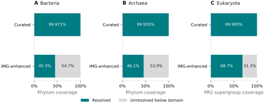
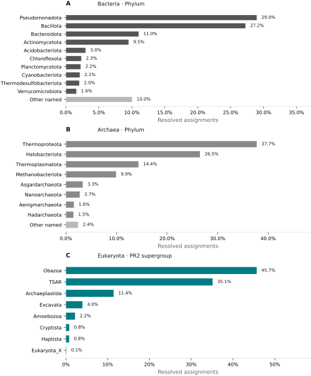
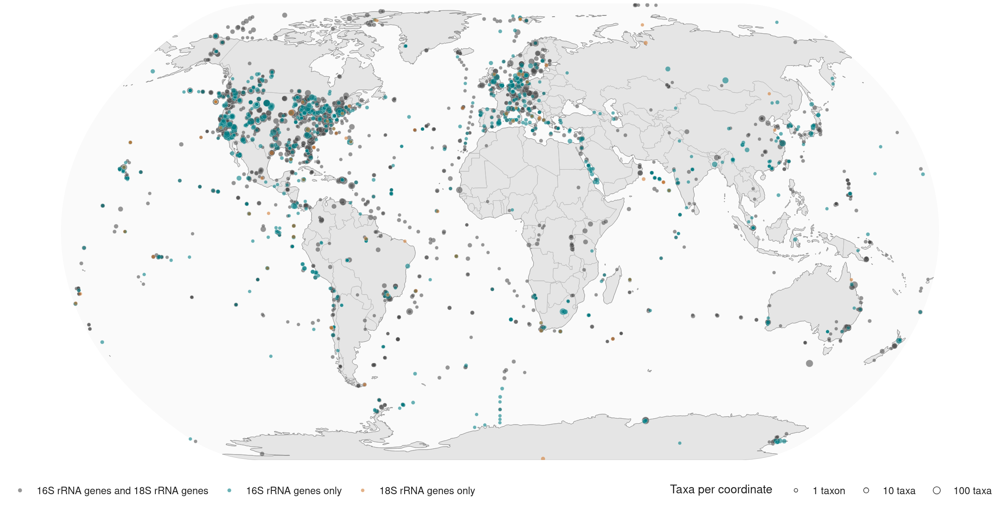

# Database composition

Database version 1.0.2 is archived at
[Zenodo](https://doi.org/10.5281/zenodo.21443919). It uses SILVA 138.2 and PR2
5.1.1 in the `curated` profile. The `img` profile contains the same references
plus IMG 16S rRNA gene and 18S rRNA gene sequences from eukcensus 2025.

## Profiles

| Profile | Source records | Unique sequences | 16S rRNA gene index | 18S rRNA gene index | Download size |
| --- | ---: | ---: | ---: | ---: | ---: |
| `curated` | 683,597 | 609,298 | 416,021 | 193,282 | 345.4 MiB |
| `img` | 1,680,777 | 1,396,949 | 1,067,340 | 329,614 | 840.9 MiB |

Five exact sequences belong to both rRNA gene indexes. Each profile stores an
exact sequence once and records both marker memberships.

IMG-derived records keep the conservative member assignment separate from the
centroid used to classify the sequence cluster. The database stores centroid
name, calibrated taxonomy, and taxonomy source as evidence fields.

### Source releases

| Source | Release | Content | `curated` records | `img` records |
| --- | --- | --- | ---: | ---: |
| [SILVA](https://www.arb-silva.de/fileadmin/silva_databases/release_138_2/Exports/SILVA_138.2_SSURef_NR99_tax_silva.fasta.gz) | 138.2 NR99 | 16S rRNA gene references and bacterial/archaeal taxonomy | 451,555 | 451,555 |
| [PR2](https://github.com/pr2database/pr2database/releases/tag/v5.1.1) | 5.1.1 | 18S rRNA gene and organellar 16S rRNA gene references; eukaryotic taxonomy | 232,042 | 232,042 |
| [IMG](https://doi.org/10.5281/zenodo.20653200) | eukcensus 2025 | Additional 16S rRNA gene and 18S rRNA gene records | 0 | 997,180 |

Exact duplicate sequences are represented once in a profile. Of the 997,180
IMG source records, 787,651 add a unique sequence to the `img` profile.

## Taxonomy

SILVA supplies bacterial and archaeal taxonomy. PR2 supplies eukaryotic
taxonomy. Exact sequences with equally preferred assignments from different
domains retain both alternatives and are reported as ambiguous.

| Preferred domain assignment | `curated` sequences | `img` sequences |
| --- | ---: | ---: |
| Bacteria | 388,861 | 857,491 |
| Archaea | 20,182 | 43,767 |
| Eukaryota | 198,605 | 288,908 |
| Unclassified | 0 | 205,133 |
| Ambiguous | 1,650 | 1,650 |

The target ranks are phylum for Bacteria and Archaea and PR2 supergroup for
Eukaryota. In database version 1.0.2, IMG sequences with a preferred domain assignment
stop at domain; 205,133 sequences remain unclassified at domain. The
target-rank resolution analysis includes domain-only sequences in the relevant
domain denominator and excludes unclassified and ambiguous assignments.
`Eukaryota_X` is retained as PR2's unassigned supergroup placeholder.

{ .docs-figure }

*Figure 1. Sequences resolved to bacterial or archaeal phylum and eukaryotic
PR2 supergroup. Percentages are calculated within each domain.*

PR2 compartment suffixes (`:apic`, `:chro`, `:chrom`, `:mito`, `:nucl`, and `:plas`)
are removed from taxonomy ranks during import. Compartment is stored in a
separate field.

{ .docs-figure }

*Figure 2. Reported lineage distributions in the SILVA and PR2 reference
component. Percentages use sequences resolved to the reported rank as the
denominator. Less abundant bacterial and archaeal lineages are combined as
“Other named.” The eukaryotic panel shows the seven most abundant named
supergroups plus `Eukaryota_X`, PR2's unassigned supergroup placeholder;
complete counts are available below.*

## IMG sampling coordinates

The IMG metadata retains the IMG Taxon OID and latitude/longitude when
both coordinates are available. Project names, contact details, comments, and
other source metadata fields are excluded.

| Coordinate measure | Count |
| --- | ---: |
| IMG Taxon OIDs | 32,521 |
| IMG Taxon OIDs with coordinates | 30,349 |
| Distinct coordinate pairs | 4,856 |
| Source records linked to coordinates | 931,810 of 997,180 |
| Coordinate pairs with 16S rRNA gene and 18S rRNA gene records | 3,445 |
| Coordinate pairs with only 16S rRNA gene records | 1,336 |
| Coordinate pairs with only 18S rRNA gene records | 75 |

{ .docs-figure }

*Figure 3. Available IMG sampling coordinates. Point diameter scales
logarithmically with the number of taxa at an exact coordinate. Coordinates
describe the profile metadata; repeated taxa or studies at one coordinate do
not measure environmental abundance or sampling effort. Select the map to open the
[interactive Plotly version](../assets/figures/img-ssu-locations.html).*

## Data and provenance

- [Profile composition](../data/database_composition.tsv)
- [Source releases and checksums](../data/database_sources.tsv)
- [Taxonomic resolution](../data/database_taxonomy_resolution.tsv)
- [Reported lineage counts](../data/database_taxonomy_lineages.tsv)
- [IMG taxon coordinates](../data/img_taxon_locations.parquet)
- [Aggregated IMG coordinate sites](../data/img_location_sites.parquet)
- [Release provenance and SHA-256 checksums](../data/database_composition_provenance.json)

The executed analysis is in
[`notebooks/database_composition.ipynb`](https://github.com/NeLLi-team/ssuextract/blob/main/notebooks/database_composition.ipynb).
