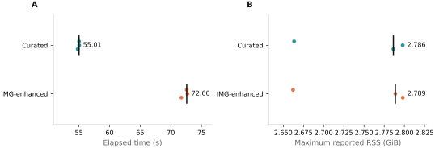

# Example runtime and memory

The bundled assembly was run with the `curated` and `img` database profiles.
Each profile had one warm-up followed by three measured runs with a fresh
Nextflow work directory. Search tasks used two threads and the Nextflow task
ceiling was eight CPUs.

| Database profile | Measured elapsed times | Median elapsed time | Median maximum reported RSS |
| --- | --- | ---: | ---: |
| `curated` | 55.01, 55.04, 54.80 s | 55.01 s | 2.786 GiB |
| `img` | 72.60, 72.73, 71.73 s | 72.60 s | 2.789 GiB |

*Points are measured runs; black marks and labels show medians. GNU time wrapped
the Nextflow command, so RSS is the command's maximum reported value rather than
the sum of concurrent workflow processes.*

These numbers describe the bundled example on the benchmark host. Runtime and
memory depend on input size, hit count, storage, and available CPUs. The source
measurements are in [`example_performance.tsv`](../data/example_performance.tsv),
and the figure is generated by `notebooks/example_performance.ipynb`.
